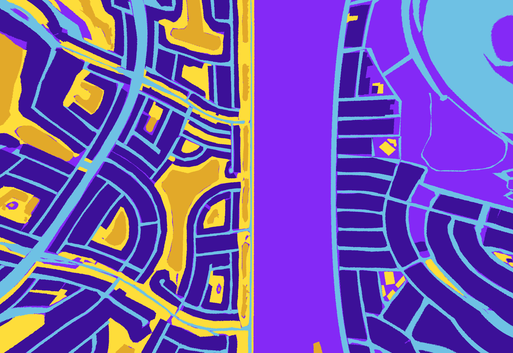
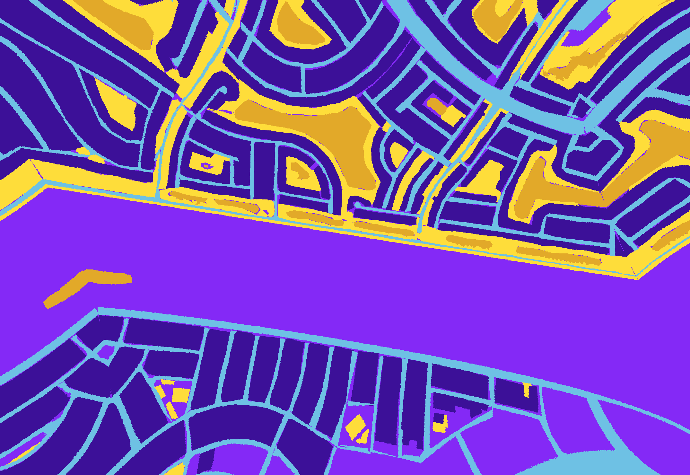
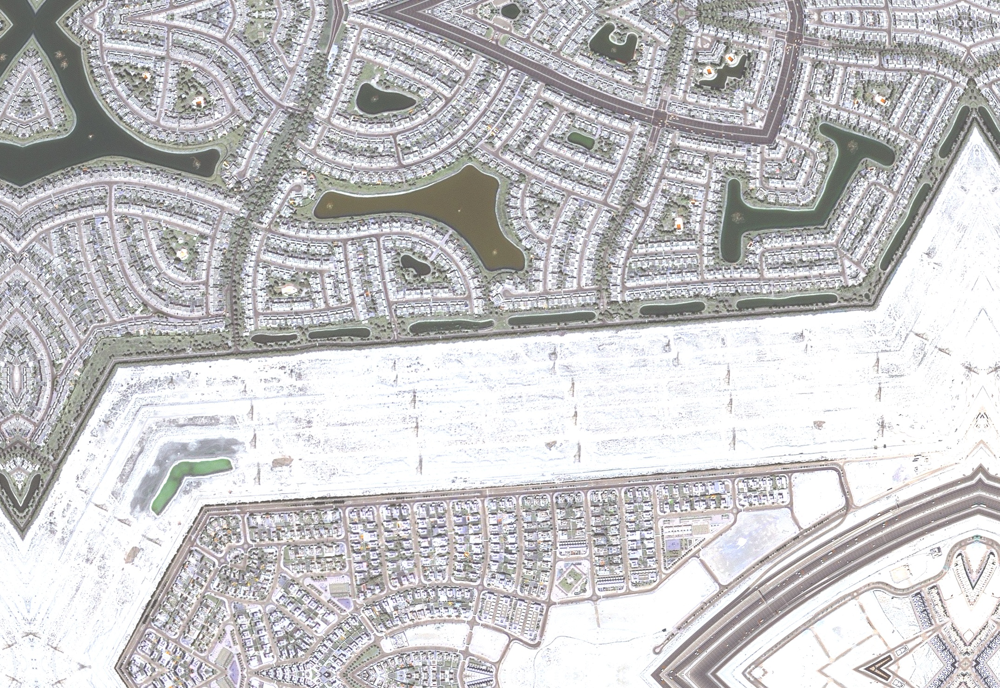
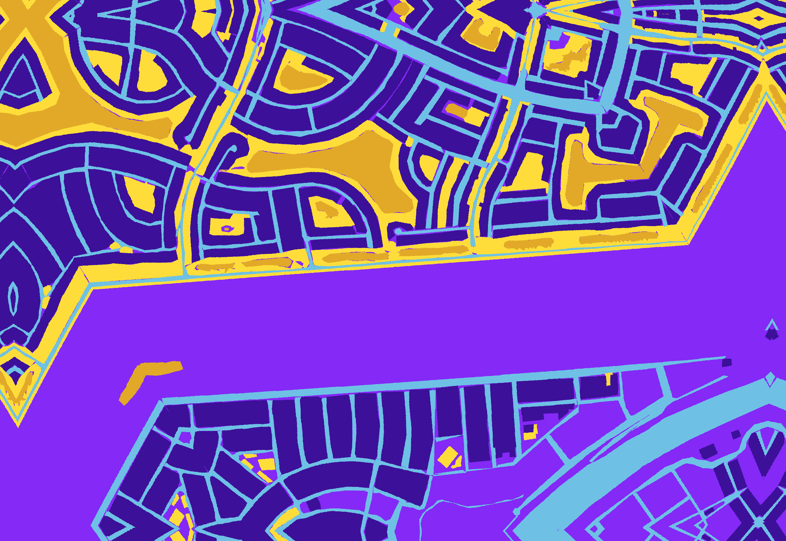

# Data Augmentation

This notebook is used to generate augmented datasets of images for various Computer Vision Tasks like Image Classification, Semantic Segmentation, Object Detection, to increase the diversity and size of the training dataset.

## Table of Contents

- [Data Augmentation](#data-augmentation)
- [Table of Contents](#table-of-contents)
- [Image Augmentation](#image-augmentation)
- [Albumentations Library](#albumentations-library)
- [Output](#output)
- [References](#references)

## Image Augmentation: 

Image augmentation refers to the process of applying a variety of transformations or modifications to an image to create new, altered versions of the original image. It is a common technique used in computer vision tasks, such as image classification, object detection, and semantic segmentation, to increase the diversity and size of the training dataset.

The goal of image augmentation is to generate new training samples that exhibit realistic variations while preserving the underlying semantics and labels of the original image. By augmenting the training data with these modified versions, the model becomes more robust, generalizes better to unseen data, and learns to handle variations, noise, and other challenges present in real-world scenarios.

Image augmentation techniques can include a wide range of operations, such as:
* **Geometric transformations:** These include operations like rotation, scaling, flipping (horizontal or vertical), cropping, translation, and shearing. These transformations modify the spatial arrangement and perspective of the objects in the image.
* **Color and contrast modifications:** Operations like brightness adjustment, contrast enhancement, saturation changes, hue shifts, and color channel swapping can be used to alter the color appearance and contrast of the image.
* **Noise addition:** Adding various types of noise, such as Gaussian noise, salt-and-pepper noise, or speckle noise, can simulate real-world image imperfections or enhance the model's robustness to noise.
* **Blur and sharpening:** Applying blurring or sharpening filters to the image can simulate different levels of focus or motion blur.
* **Elastic deformations:** Elastic deformations introduce local distortions to the image, mimicking deformations that may occur in real-world scenarios.
* **Randomized combinations:** Multiple augmentation operations can be combined randomly to create more complex variations, such as applying multiple transformations simultaneously or in a sequential manner.

## Albumentations Library

Utilization of Albumentations Library for augmentation of images, which provides a wide range of image transformation techniques. Offers methods to apply pixel-level augmentations from Albumentations to create new images from the original one like:

* Albumentations is adopted due to its efficiency, versatility, and extensive range of transformations
* Rich Set of Transformations: The library offers a comprehensive collection of image augmentations, including geometric transformations (e.g., rotation, scaling, cropping), color space manipulations (e.g., brightness, contrast, saturation adjustments), noise addition, blur, and more.
* Efficient and Fast: Albumentations is designed to be fast and memory-efficient, making it suitable for large-scale data augmentation tasks and real-time applications.
* Easy Integration: Albumentations seamlessly integrates with popular deep learning frameworks like PyTorch and TensorFlow. It allows direct integration into the training pipeline and facilitates the augmentation of input images in real-time during the training process.
* Support for Multiple Data Formats: Albumentations supports various input and output data formats, including NumPy arrays, PIL images, OpenCV images, and more. This flexibility allows easy integration with different data sources and processing pipelines.
* Customizability: The library offers extensive customization options, allowing you to specify parameters and control the intensity and probability of each augmentation technique. It also supports sequential and simultaneous application of multiple transformations.
* Support for Bounding Boxes and Masks: Albumentations provides specialized transformations for handling bounding boxes and masks associated with object detection and segmentation tasks. It ensures that the spatial consistency between the images and corresponding annotations is maintained during augmentation.

## Output:

Original Input Image                                         |  Original Input Mask
:-----------------------------------------------------------:|:-------------------------------------------:
                  |  

Transformed Images                                           |  Transformed Masks
:-----------------------------------------------------------:|:----------------------------------------:
  |  
  |  
  |  
  |  
  |  
  |  
  |  
  |  
  |  
 |  
 |  
 |  
 |  
 |  
 |  
 |  

## References

* [Albumentations](https://pypi.org/project/albumentations/)
* [drone-images-semantic-segmentation](https://github.com/ayushdabra/drone-images-semantic-segmentation) 
* [Dataset: Semantic segmentation of aerial imagery](https://www.kaggle.com/datasets/humansintheloop/semantic-segmentation-of-aerial-imagery)