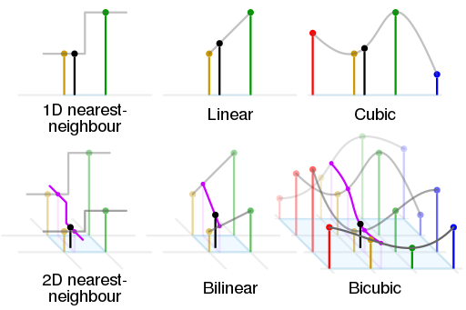
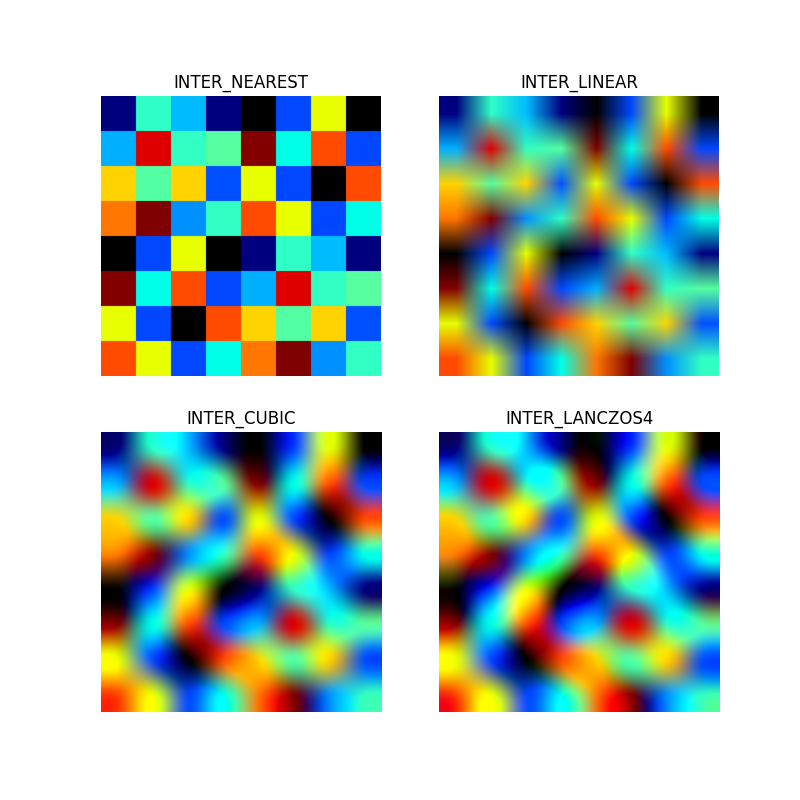
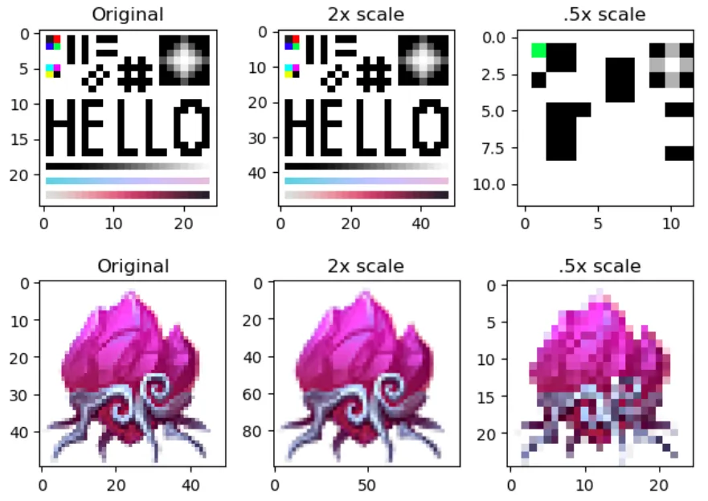
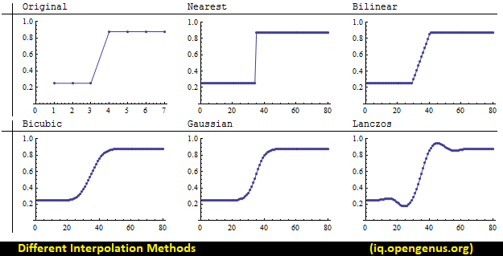
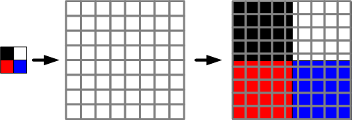

# Resize: using Interpolation

This notebook is used to resize down large Aerial/Satellite Images dataset for training on local system/cloud service with limited RAM/GPU Memory

## Table of Contents

- [Resize: using Interpolation](#resize-using-interpolation)
- [Table of Contents](#table-of-contents)
- [Interpolation](#interpolation)
- [INTER_LANCZOS4: Lanczos interpolation over 8 x 8 pixel neighborhood](#inter_lanczos4-lanczos-interpolation-over-8-x-8-pixel-neighborhood)
- [INTER_NEAREST_EXACT: nearest neighbor interpolation technique](#inter_nearest_exact-nearest-neighbor-interpolation-technique)
- [References](#references)

## Interpolation

Interpolation refers to the process of estimating pixel values for positions that are not explicitly sampled in an image. It involves filling in the missing information or generating new data points based on the known data points in the image.
The choice of interpolation method depends on factors such as the desired image quality, computational complexity, and specific requirements of the task. 

* **Nearest-neighbor interpolation:** This method assigns the value of the closest pixel to the target position. It is the simplest and fastest interpolation technique but can result in blocky or pixelated output.

* **Bilinear interpolation:** Bilinear interpolation considers the weighted average of the four nearest neighboring pixels to estimate the value at the target position. It provides smoother results compared to nearest-neighbor interpolation.

* **Bicubic interpolation:** Bicubic interpolation extends bilinear interpolation by considering a larger neighborhood of pixels and applying a cubic interpolation to estimate the pixel value. It produces even smoother results but is more computationally expensive.

* **Lanczos interpolation:** Lanczos interpolation uses a windowed sinc function to interpolate pixel values. It can produce high-quality results but is more computationally intensive than other interpolation methods.

In addition to these basic interpolation techniques, more advanced methods based on splines, machine learning, or deep learning can be used for specific applications or when higher accuracy is required. These advanced techniques aim to model more complex relationships between pixels and can provide improved interpolation results.

## INTER_LANCZOS4: Lanczos interpolation over 8 x 8 pixel neighborhood

* It is an advanced interpolation algorithm based on the Lanczos interpolation technique.
* Lanczos interpolation, in general, uses a windowed sinc function to estimate pixel values. The sinc function is a mathematical function that exhibits desirable properties for interpolation. The Lanczos interpolation method applies a windowing function to the sinc function to limit the influence of distant pixels on the interpolation result.
* INTER_LANCZOS4, specifically, refers to a variant of Lanczos interpolation with a window size of 8. It uses an 8x8 neighborhood of pixels around the target position to estimate the pixel value. The interpolation process involves evaluating the weighted average of the neighboring pixels based on the Lanczos kernel function.
* INTER_LANCZOS4 is known for its ability to produce high-quality interpolation results, especially when resizing images or scaling them up. It can preserve fine details and reduce artifacts such as aliasing or blurring that can occur with other interpolation methods.
* However, it's worth noting that INTER_LANCZOS4 is computationally more intensive compared to simpler interpolation methods like bilinear or bicubic. Therefore, it may require more processing time, especially when applied to large images or in real-time applications.
* Overall, INTER_LANCZOS4 is a popular choice for tasks that require high-quality interpolation, such as image resizing, where maintaining image sharpness and detail is important.

## INTER_NEAREST_EXACT: nearest neighbor interpolation technique

* Nearest-neighbor interpolation, also known as the nearest-neighbor method, is the simplest and most straightforward interpolation technique used in computer vision and image processing. It is commonly used when there is a need to resize or resample an image.
* In nearest-neighbor interpolation, the value of the closest pixel in the original image is assigned to the corresponding position in the resized image. The algorithm does not consider the values of the surrounding pixels or perform any calculations to estimate the pixel value.
* The process of nearest-neighbor interpolation can be summarized as follows: Given an original image and the desired size of the resized image, calculate the scaling factor in the horizontal and vertical directions. For each pixel in the resized image, map its position back to the original image using the inverse of the scaling factor. Round the mapped position to the nearest whole number to determine the closest pixel in the original image. Assign the value of the closest pixel to the corresponding position in the resized image.
* Nearest-neighbor interpolation is computationally efficient since it only requires looking up the nearest pixel value without any calculations. However, the resulting image may appear blocky or pixelated, especially when resizing an image to a larger size or when there are significant differences between neighboring pixel values.
* While nearest-neighbor interpolation is simple and fast, it is not suitable for applications where high-quality image output is required. Other interpolation methods such as bilinear, bicubic, or Lanczos interpolation are often preferred as they provide smoother results by considering the values of surrounding pixels.

## References

* [Different Interpolation methods in OpenCV](https://iq.opengenus.org/different-interpolation-methods-in-opencv/)
* [Geometric Image Transformations](https://docs.opencv.org/3.4/da/d54/group__imgproc__transform.html)
* [Medium: Image interpolation in OpenCV](https://zahid-parvez.medium.com/image-interpolation-in-opencv-5a3b96111872)
* [Stack Overflow: Choose best Interpolation method](https://stackoverflow.com/questions/23853632/which-kind-of-interpolation-best-for-resizing-image)
