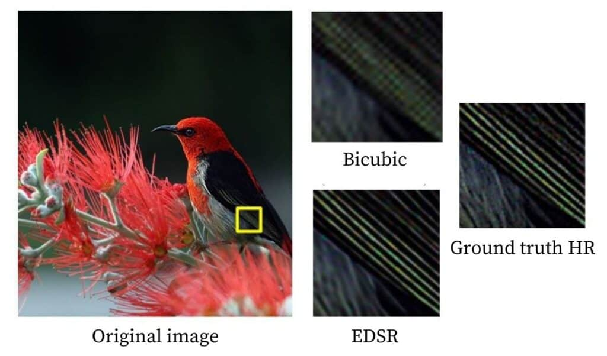
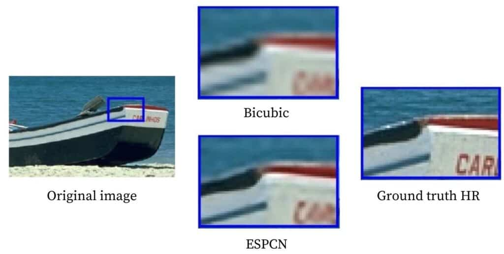
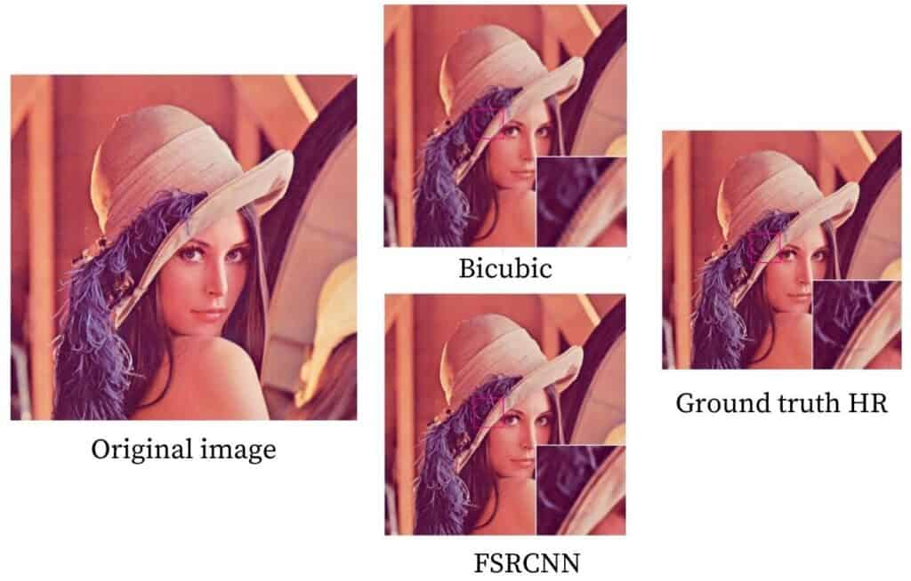
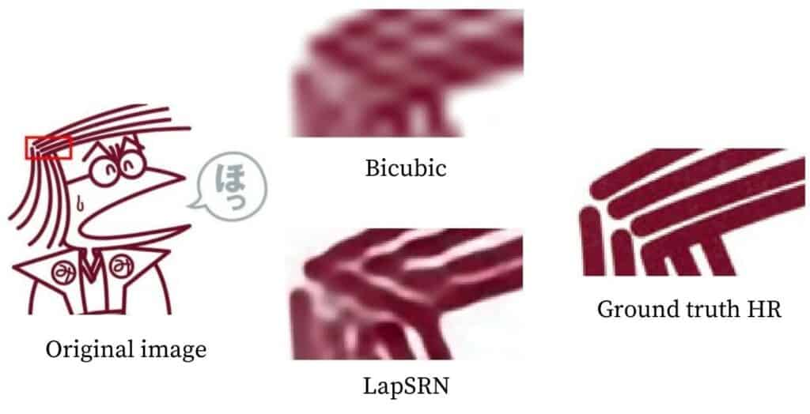

# SuperResolution

This notebook is used to generate Super Resolution images using Deep Learning Techniques and OpenCV, using Pre-trained Model Weights

Make sure you use GPU runtime for this notebook. For Google Colab, go to `Runtime` -> `Change runtime type` and select `GPU` as the hardware accelerator. As using only `CPU` runtime will be very slow for training model.

## Table of Contents
- [SuperResolution](#superresolution)
- [Table of Contents](#table-of-contents)
- [Theory](#theory)
- [EDSR](#edsr)
- [ESPCN](#espcn)
- [FSRCNN](#fsrcnn)
- [LapSRN](#lapsrn)
- [References](#references)

## Theory

Superresolution in OpenCV refers to the process of enhancing the resolution and level of detail in an image or video beyond its original quality. It aims to reconstruct high-resolution images or videos from low-resolution inputs by estimating missing information and adding new details.

**Original Image**

**Upscaled by Bilinear Interpolation (factor of 3)**

**Upscaled by FSRCNN (factor of 3)**

**Upscaled by ESDR (factor of 3)**

Deep learning-based superresolution in OpenCV refers to the use of deep neural networks to enhance the resolution of images or videos beyond their original quality. It involves training and utilizing convolutional neural network (CNN) models to learn the complex mappings between low-resolution and high-resolution images. OpenCV's DNN (Deep Neural Network) module provides the framework for implementing and deploying deep learning models for superresolution tasks.

## EDSR

* Lim et al. proposed two methods in their paper, EDSR, and MDSR. Different models are required for different scales in the EDSR method. In comparison a single model can reconstruct various scales in the MDSR model. However, in this article, we will discuss only EDSR.
* A ResNet style architecture is used without the Batch Normalization layers. They found that those layers get rid of range flexibility from the features’ networks, improving the performance. This allows them to build a larger model with better performance. To counter the instability found in large models, they used residual scaling with a factor of 0.1 in each residual block by placing constant scaling layers after the last convolutional layers. Also, ReLu activation layers are not used after the residual blocks.
* The architecture is initially employed for a scaling factor of 2. Then these pre-trained weights are used when training for a scaling factor of 3 and 4. This not only accelerates the training but also improves the performance of the models. The image below is a comparison of the 4x super-resolution result of the EDSR method, bicubic interpolation method and the original high-resolution image.

## ESPCN

* Instead of performing super-resolution after upscaling the low resolution using a bicubic filter, Shi et al. extract feature maps in the low resolution itself and use complex upscaling filters to get the result. The upscaling layers are only deployed at the end of the network. This ensures that the complex operations occurring in the model happen on lower dimensions, which makes it fast, especially compared to other techniques.
* The base structure of ESPCN is inspired by SRCNN. Instead of using the customary convolution layers, sub-pixel convolution layers are utilized, which act like deconvolution layers. The sub-pixel convolution layer is utilized in the last layer to produce the high-resolution map. Along with this, they found that the Tanh activation function works much better than the standard ReLu function.
* The image below is a comparison of 3x super-resolution result of the ESPCN method, bicubic interpolation method and the original high resolution image.

## FSRCNN

* FSRCNN and ESPCN have very similar concepts. Both of them have their base structure inspired by SRCNN and employ upscaling layers at the end for speed instead of interpolating it early on. Furthermore, they even shrink the input feature dimension and use smaller filter sizes before finally using more mapping layers, which results in the model being even smaller and faster.
* The architecture starts with convolutional layers, with its filter size dropped to 5 from the 9 of SRCNN. Shrinking layers are applied as the input resolution itself can be huge and take much time. Filter size of 1×1 is used, which does not increase the computational cost.
* The authors next focus on reducing the non-linear mapping that plays an integral part in slowing down the model without compromising accuracy. Hence, they use multiple 3×3 filters. The next expanding section is the opposite of the shrinking section, before finally applying deconvolutional layers for upsampling. For the activation function, PReLu was used.
* The image below is a comparison of 3x super-resolution result of the FSRCNN method, bicubic interpolation method and the original high resolution image.

## LapSRN

* LapSRN offers a middle ground between the contrasting strategies of upscaling at the start and end. It proposes to upscale gently till the end. Its name is based on Laplacian pyramids, and the architecture is basically like a pyramid upscaling the lower resolution image until the end. For speed, parameter sharing is heavily relied on; and just like the EDSR models, they also proposed a single model that can reconstruct different scales calling it MS-LapSRN. However, in this article, we will discuss only LapSRN.
* The models consist of two branches: feature extraction and an image reconstruction branch. Parameter sharing occurs among the different scales, i.e., 4x uses parameters from 2x model and so on. This means that one pyramid is used for scaling 2x, two for 4x, and three for 8x! Making such deep models means they can suffer from gradient vanishing problems. So they try different types of local skip connections like distinct-source skip connections and shared-source connections. Charbonnier loss is used for the model’s loss function, and batch normalization layers are not used.
* The image below is a comparison of 8x super-resolution result of LapSRN method, bicubic interpolation method and the original high resolution image.

## References

* [Medium: Deep Learning based Super Resolution with OpenCV](https://towardsdatascience.com/deep-learning-based-super-resolution-with-opencv-4fd736678066)
* [Super Resolution in OpenCV](https://learnopencv.com/super-resolution-in-opencv/)
* [EDSR: Paper](https://arxiv.org/pdf/1707.02921.pdf)
* [EDSR: Model](https://github.com/Saafke/EDSR_Tensorflow/tree/master/models)
* [ESPCN: Paper](https://arxiv.org/pdf/1609.05158.pdf)
* [ESPCN: Model](https://github.com/fannymonori/TF-ESPCN/tree/master/export)
* [FSRCNN: Paper](https://arxiv.org/pdf/1608.00367.pdf)
* [FSRCNN: Model](https://github.com/Saafke/FSRCNN_Tensorflow/tree/master/models)
* [LapSRN: Paper](https://arxiv.org/pdf/1710.01992.pdf)
* [LapSRN: Model](https://github.com/fannymonori/TF-LapSRN/tree/master/export)