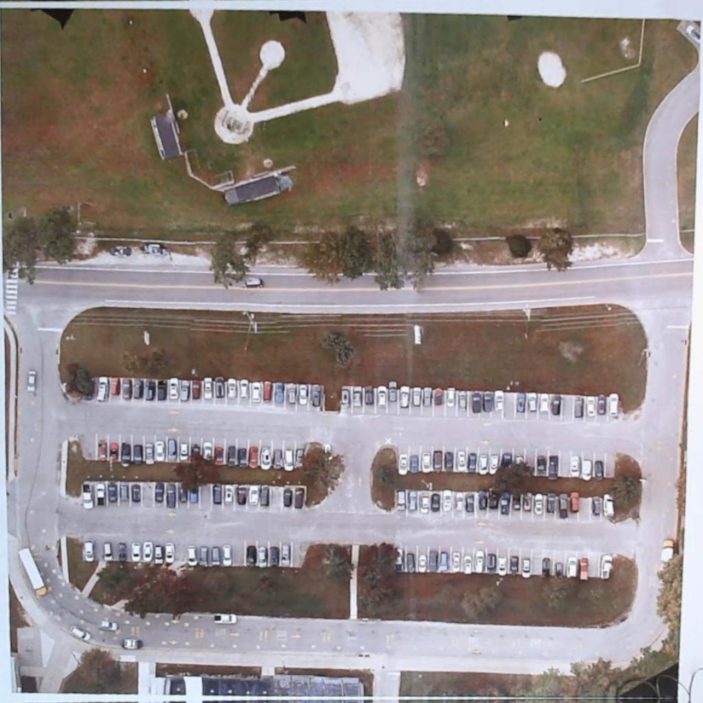
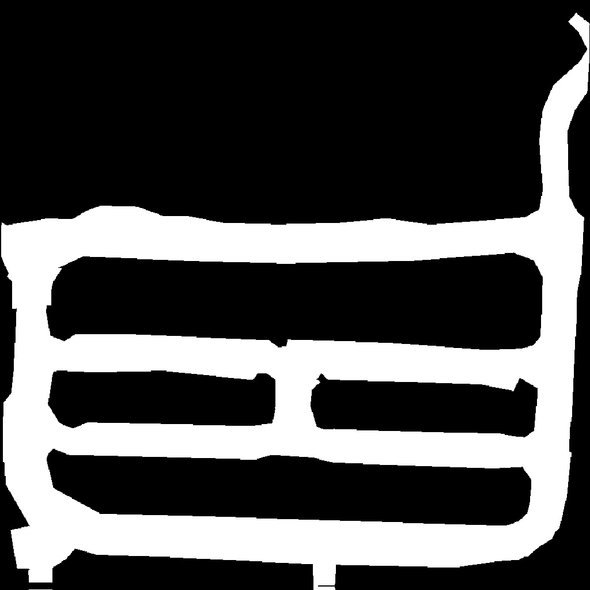
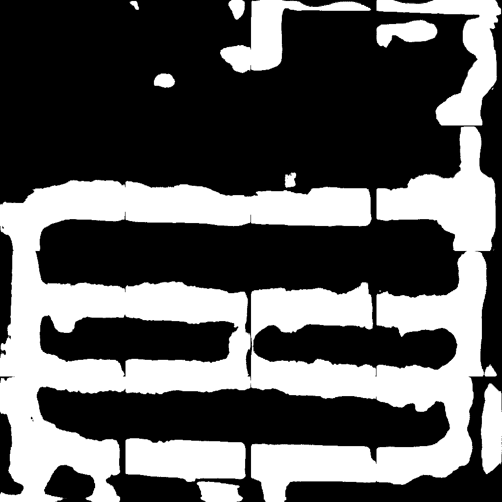
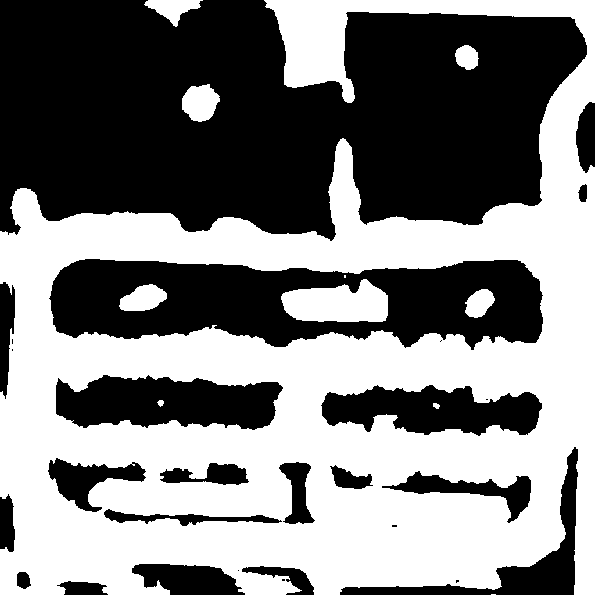

# Road Segmentation of Low Quality Arena Image using U-Net:

* **Training:** 
* **Testing:** 
* **Data Augmentation:** 

This notebook is used to generate Road Segmentation Mask of Low Quality Arena Image captured using Overhead Camera, using Transfer Learning Technique, utilizing U-Net as the architechure of the Deep-Learning Model

Make sure you use GPU runtime for this notebook. For Google Colab, go to `Runtime` -> `Change runtime type` and select `GPU` as the hardware accelerator. As using only `CPU` runtime will be very slow for training model.

## Table of Contents

- [Road Segmentation of Low Quality Arena Image using U-Net](#road-segmentation-of-low-quality-arena-image-using-u-net)
- [Table of Contents](#table-of-contents)
- [U-Net](#u-net)
- [UNET - Network Architecture](#unet---network-architecture)
- [Errors](#errors)
- [Prediction with Smooth Blending](#prediction-with-smooth-blending)
- [Training Curves](#training-curves)
- [Output](#output)
- [Training Metrics](#training-metrics)
- [References](#references)

## U-Net
[U-Net](https://arxiv.org/abs/1505.04597) was developed by Olaf Ronneberger et al. for Bio Medical Image Segmentation. The architecture contains two paths. First path is the contraction path (also called as the encoder) which is used to capture the context in the image. The encoder is just a traditional stack of convolutional and max pooling layers. The second path is the symmetric expanding path (also called as the decoder) which is used to enable precise localization using transposed convolutions. Thus, it is an end-to-end fully convolutional network (FCN), i.e. it only contains Convolutional layers and does not contain any Dense layer because of which it can accept image of any size.

In the original paper, the UNet is described as follows:

<em>U-Net architecture (example for 32x32 pixels in the lowest resolution). Each blue box corresponds to a multi-channel feature map. The number of channels is denoted on top of the box. The x-y-size is provided at the lower left edge of the box. White boxes represent copied feature maps. The arrows denote the different operations.</em>

## UNET - Network Architecture
UNET is a U-shaped encoder-decoder network architecture, which consists of four encoder blocks and four decoder blocks that are connected via a bridge. The encoder network (contracting path) half the spatial dimensions and double the number of filters (feature channels) at each encoder block. Likewise, the decoder network doubles the spatial dimensions and half the number of feature channels.

* **Encoder Network**
The encoder network acts as the feature extractor and learns an abstract representation of the input image through a sequence of the encoder blocks. Each encoder block consists of two 3x3 convolutions, where each convolution is followed by a ReLU (Rectified Linear Unit) activation function. The ReLU activation function introduces non-linearity into the network, which helps in the better generalization of the training data. The output of the ReLU acts as a skip connection for the corresponding decoder block. Next, follows a 2x2 max-pooling, where the spatial dimensions (height and width) of the feature maps are reduced by half. This reduces the computational cost by decreasing the number of trainable parameters.
* **Skip Connections**
These skip connections provide additional information that helps the decoder to generate better semantic features. They also act as a shortcut connection that helps the indirect flow of gradients to the earlier layers without any degradation. In simple terms, we can say that skip connection helps in better flow of gradient while backpropagation, which in turn helps the network to learn better representation.
* **Bridge**
The bridge connects the encoder and the decoder network and completes the flow of information. It consists of two 3x3 convolutions, where each convolution is followed by a ReLU activation function.
* **Decoder Network**
The decoder network is used to take the abstract representation and generate a semantic segmentation mask. The decoder block starts with a 2x2 transpose convolution. Next, it is concatenated with the corresponding skip connection feature map from the encoder block. These skip connections provide features from earlier layers that are sometimes lost due to the depth of the network. After that, two 3x3 convolutions are used, where each convolution is followed by a ReLU activation function. The output of the last decoder passes through a 1x1 convolution with sigmoid activation. The sigmoid activation function gives the segmentation mask representing the pixel-wise classification.

## Errors

If the following error occurs:

Go to File: `/usr/local/lib/python3.10/dist-packages/efficientnet/keras.py` and change the following lines

* `from . import inject_keras_modules, init_keras_custom_objects` ---> `from . import inject_keras_modules, init_tfkeras_custom_objects`
* `init_keras_custom_objects()` ---> `init_tfkeras_custom_objects()`

## Prediction with Smooth Blending

* Make smooth predictions by blending image patches, such as for image segmentation, rather than jagged ones. 
* One challenge of using a U-Net for image segmentation is to have smooth predictions, especially if the receptive field of the neural network is a small amount of pixels.

## Training Curves

### Training and Validation Loss

### Training and Validation IOU

## Output:

* The dataset consists of aerial imagery of Arena Image captured using Overhead Camera, and annotated using Roboflow. Followed by which Data Augmentation was utilized to generate the final dataset.

Original Input (Arena) Image             | Ground Truth Mask
:---------------------------------------:|:-----------------------------------------------:
 | 

Ground Truth                                    | Predicted Mask without Smooth Blending                         | Predicted Mask with Smooth Blending
:----------------------------------------------:|:-------------------------------------------------------------:|:---------------------------------------------------------------------------:
 |  | 

## Training Metrics

No. of Epoch | Loss   | Accuracy | Jaccard Coefficient | Validation Loss | Validation Accuracy | Validation Jaccard Coefficient 
:-----------:|:------:|:--------:|:-------------------:|:---------------:|:-------------------:|:------------------------------:
1            | 0.7851 | 0.5006   | 0.3556              | 0.7568          | 0.8235              | 0.3915
2            | 0.6926 | 0.8248   | 0.5852              | 0.6472          | 0.8630              | 0.6957
3            | 0.6425 | 0.8619   | 0.7061              | 0.6422          | 0.8636              | 0.7049
4            | 0.6274 | 0.8815   | 0.7505              | 0.6424          | 0.8703              | 0.6777
5            | 0.6149 | 0.8948   | 0.7654              | 0.6057          | 0.9030              | 0.7823

## References

* [U-Net: Convolutional Networks for Biomedical Image Segmentation](https://arxiv.org/abs/1505.04597)
* [drone-images-semantic-segmentation](https://github.com/ayushdabra/drone-images-semantic-segmentation) 
* [OpenAerialMap: Arena Image](https://map.openaerialmap.org/#/-74.36152517795563,39.61328837693878,18/square/03201013020113301121/5bd3433ea6d4450006176d5a?_k=2rebq1)
* [Roboflow: Annotate Images](https://roboflow.com/)
* [DigitalSreeni: 228 - Semantic segmentation of aerial (satellite) imagery using U-net](https://www.youtube.com/watch?v=jvZm8REF2KY)
* [Dr. Sreenivas Bhattiprolu: GitHub - 228_semantic_segmentation_of_aerial_imagery_using_unet](https://github.com/bnsreenu/python_for_microscopists/tree/master/228_semantic_segmentation_of_aerial_imagery_using_unet)
* [DigitalSreeni: 229 - Smooth blending of patches for semantic segmentation of large images (using U-Net)](https://www.youtube.com/watch?v=HrGn4uFrMOM&list=PLZsOBAyNTZwbR08R959iCvYT3qzhxvGOE&index=30)
* [Dr. Sreenivas Bhattiprolu: GitHub - 229_smooth_predictions_by_blending_patches](https://github.com/bnsreenu/python_for_microscopists/tree/master/229_smooth_predictions_by_blending_patches)
* [DigitalSreeni: Python tips and tricks - 8: Working with RGB (and Hex) masks for semantic segmentation](https://www.youtube.com/watch?v=sGAwx4GMe4E)
* [U-net for image segmentation](https://www.youtube.com/playlist?list=PLZsOBAyNTZwbR08R959iCvYT3qzhxvGOE)
* [Vooban: GitHub - Smoothly-Blend-Image-Patches](https://github.com/Vooban/Smoothly-Blend-Image-Patches)
* [Medium: What is UNET?](https://medium.com/analytics-vidhya/what-is-unet-157314c87634)
