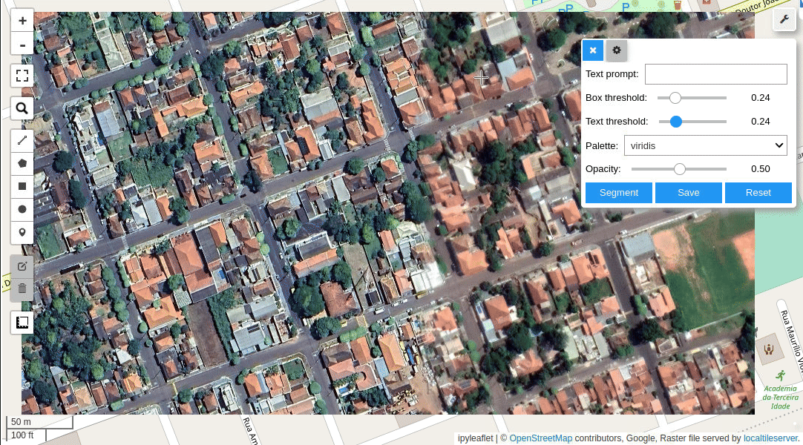
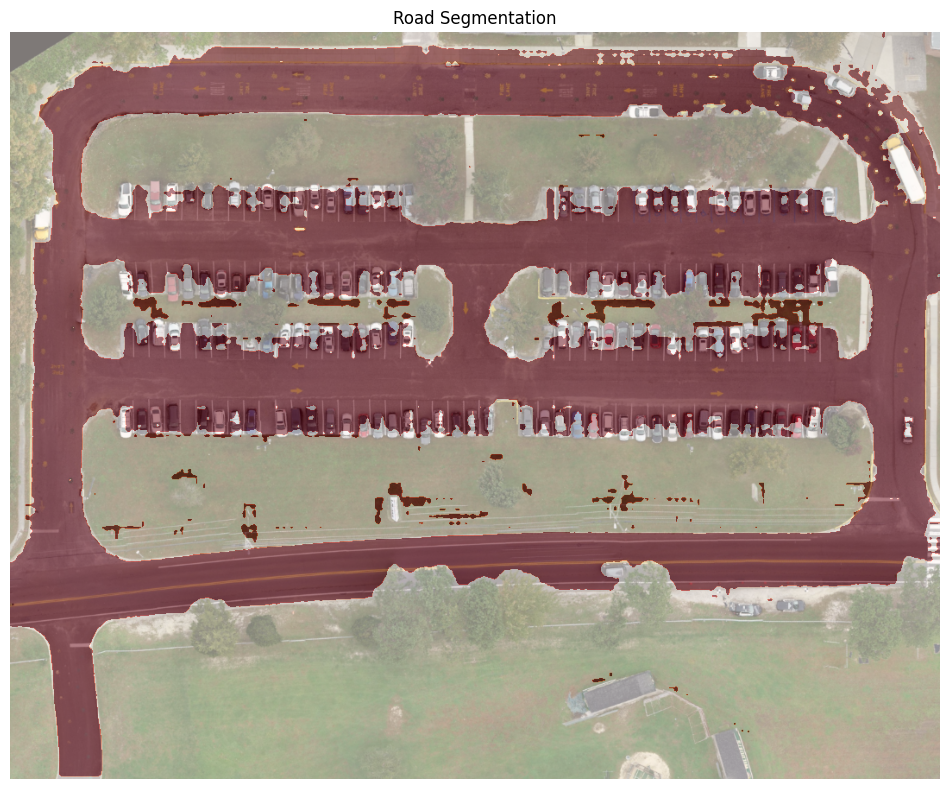

# Segmenting remote sensing imagery with text prompts using the Segment Anything Model (SAM)

This notebook is used to generate object masks of specific classes from text prompts with the Segment Anything Model (SAM).

Make sure you use GPU runtime for this notebook. For Google Colab, go to `Runtime` -> `Change runtime type` and select `GPU` as the hardware accelerator.

## Table of Contents

- [Segmenting remote sensing imagery with text prompts using the Segment Anything Model (SAM)](#segmenting-remote-sensing-imagery-with-text-prompts-using-the-segment-anything-model-sam)
- [Table of Contents](#table-of-contents)
- [samgeo](#samgeo)
- [Output](#output)
- [References](#references)

## samgeo

* A Python package for segmenting geospatial data with the Segment Anything Model (SAM)
* The segment-geospatial package draws its inspiration from segment-anything-eo repository authored by Aliaksandr Hancharenka. To facilitate the use of the Segment Anything Model (SAM) for geospatial data, I have developed the segment-anything-py and segment-geospatial Python packages, which are now available on PyPI and conda-forge. My primary objective is to simplify the process of leveraging SAM for geospatial data analysis by enabling users to achieve this with minimal coding effort. I have adapted the source code of segment-geospatial from the segment-anything-eo repository, and credit for its original version goes to Aliaksandr Hancharenka.

Interactive Segmentation using Text Prompts

🆓 Free software: MIT license

📖 Documentation: https://samgeo.gishub.org

## Output:

Original Input Image                      |  Road Segmentation
:----------------------------------------:|:-----------------------------------------:
  |  

Original Input Image                      |  Road Segmentation Mask
:----------------------------------------:|:----------------------------------------:
  |  

### References
* [segment-geospatial](https://samgeo.gishub.org/)
* [Segmenting remote sensing imagery with text prompts and the Segment Anything Model (SAM)](https://samgeo.gishub.org/examples/text_prompts/) 