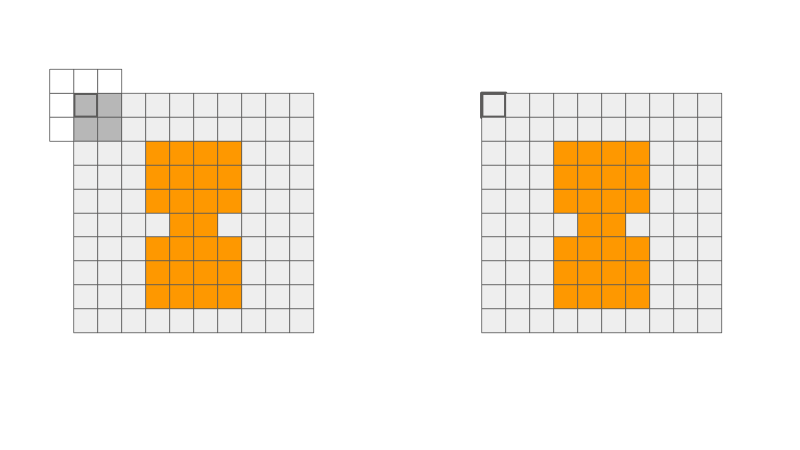

# Occupancy Grid for Path-Planning using Erosion

This notebook is used to generate Occupancy Grid for Path Planning using the Road Segmentation Mask and dimensions of Autonomous Ground Vehicle

## Table of Contents
- [Occupancy Grid for Path-Planning using Erosion](#occupancy-grid-for-path-planning-using-erosion)
- [Table of Contents](#table-of-contents)
- [Occupancy Grid](#occupancy-grid)
- [Erosion in Computer Vision](#erosion-in-computer-vision)
- [Output](#output)
- [References](#references)

## Occupancy Grid

* A 2D occupancy grid is a specific type of occupancy grid that represents the environment in a two-dimensional space. It is a discretized grid where each grid cell represents the occupancy state of that location in the 2D world.
* In a 2D occupancy grid, each grid cell can have one of three states: occupied, free, or unknown. These states indicate whether a particular location is occupied by an obstacle, known to be free and accessible, or unknown. Typically, a binary representation is used, where occupied cells are denoted as 1 and free or unknown cells as 0.
* The 2D occupancy grid can be visualized as a matrix or array of cells, where each cell corresponds to a specific position in the 2D space. The resolution or granularity of the grid determines the level of detail and accuracy in representing the environment. Finer resolutions provide more precise representations but require more memory and computational resources.
* The occupancy grid is useful in various robotic applications, such as localization, mapping, and path planning. It allows robots to reason about obstacles and plan collision-free paths in the 2D space. By integrating sensor measurements over time, the occupancy grid can be continuously updated to maintain an accurate representation of the environment.

## Erosion in Computer Vision

* In computer vision, erosion is a morphological operation used to remove or erode the boundaries of objects in an image. It is a fundamental image processing technique that operates on binary or grayscale images.
* Erosion works by sliding a structuring element, which is a small binary mask or kernel, over the image and checking if all the pixels in the neighborhood of each image pixel match the corresponding pixels in the structuring element. If all the pixels match, the pixel at the center of the structuring element is preserved; otherwise, it is eroded or set to a different value.
* The erosion operation is based on the concept of set theory, where an image is treated as a set of pixels. The structuring element defines the neighborhood or shape of the set, and erosion modifies the shape of the set by removing pixels that do not match the structuring element.
* In binary images, erosion causes objects to shrink or get thinner. It removes the boundary pixels of objects that do not match the structuring element, leading to a reduction in object size and the elimination of small object details or noise. Erosion can be used to separate connected objects or to smooth object boundaries.
* In grayscale images, erosion is applied by comparing the intensity values of pixels in the neighborhood with the structuring element. The resulting pixel value is the minimum value among the neighborhood pixels, effectively causing the image to get darker and features to become thinner.
* The size and shape of the structuring element used for erosion play a crucial role in the operation's effect. A larger structuring element removes larger portions of the objects, while a smaller one preserves finer details. Common structuring elements include squares, rectangles, circles, and custom-shaped kernels.
* Erosion is often used in combination with other morphological operations, such as dilation, opening, and closing, to achieve specific image processing goals. These operations can be applied iteratively to achieve desired effects or to perform tasks such as noise removal, object segmentation, or feature extraction.

## Output
Original Input Mask                        | Occupancy Grid
:------------------------------------------:|:-------------------------------------------:
 | 

## References

* [Occupancy Grid](https://in.mathworks.com/help/robotics/ug/occupancy-grids.html)
* [Erosion](https://www.geeksforgeeks.org/erosion-dilation-images-using-opencv-python/)
* [Medium: Erosion](https://towardsdatascience.com/image-processing-part-3-dbf103622909)