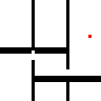
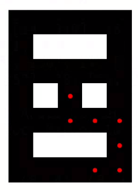
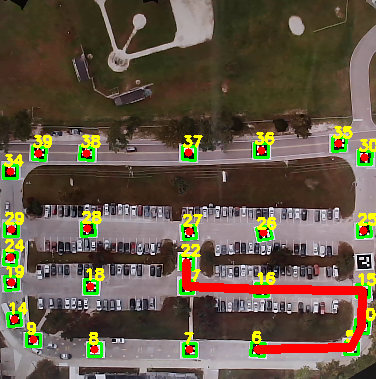
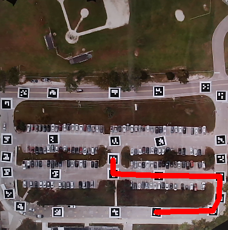

# Path-Planning using ArUco Markers

This notebook is used to generate path using ArUco Markers for Autonomous Ground Vehicle. Path-Planning using On-Ground Markers for Faster/More-Efficient Path Finding.

## Table of Contents
- [Path-Planning using ArUco Markers](#path-planning-using-aruco-markers)
- [Table of Contents](#table-of-contents)
- [A*(star) Algorithm](#astar-algorithm)
- [Global Latitude & Longitute of ArUco (On-Ground) Markers](#global-latitude--longitute-of-aruco-onground-markers)
- [Usage](#usage)
- [Path Finding using ArUco Markers](#path-finding-using-aruco-markers)
- [Demo](#demo)
- [Future Work](#future-work)
- [References](#references)

## A*(star) Algorithm
The A* (pronounced "A-star") algorithm is a widely used pathfinding algorithm in computer science and artificial intelligence. It is particularly efficient for finding the shortest path between two points in a graph or grid-based environment. The algorithm combines the best features of Dijkstra's algorithm (for finding the shortest path) and Greedy Best-First Search (for heuristic-based exploration).

Here's a high-level explanation of how the A* algorithm works:

1. Initialize the algorithm by defining the start and goal nodes.

2. Create an open set to keep track of the nodes that need to be evaluated. Initially, the open set contains only the start node.

3. Create a closed set to keep track of the nodes that have been evaluated.

4. Assign a tentative cost (usually denoted as "g-score") to each node, indicating the cost of reaching that node from the start node. The cost can be measured by the distance traveled or other factors, depending on the problem domain.

5. Assign a heuristic estimate of the cost to reach the goal from each node (usually denoted as "h-score"). This estimate is typically based on a heuristic function such as the straight-line distance (Euclidean distance) between two points. The heuristic function should be admissible, meaning it never overestimates the actual cost.

6. Calculate the "f-score" for each node, which is the sum of the g-score and h-score. The f-score represents the total estimated cost of the path passing through that node.

7. While the open set is not empty, repeat the following steps:
   a. Select the node with the lowest f-score from the open set. This node becomes the current node.
   b. If the current node is the goal node, the algorithm has found the shortest path. Trace back the path from the goal node to the start node using the parent pointers stored during the search.
   c. Move the current node from the open set to the closed set, indicating that it has been evaluated.
   d. For each neighboring node of the current node:
      - If the neighboring node is already in the closed set, skip it.
      - Calculate a new tentative g-score for the neighboring node, based on the g-score of the current node and the cost to move from the current node to the neighboring node.
      - If the neighboring node is not in the open set, add it to the open set.
      - If the neighboring node is already in the open set and the new g-score is lower than its previous g-score, update the g-score and recalculate the f-score.
      - Set the parent pointer of the neighboring node to the current node.

8. If the open set becomes empty before reaching the goal, it means there is no path from the start to the goal.

The A* algorithm uses the heuristic estimates (h-scores) to guide the search towards the goal, prioritizing nodes that appear to be closer to the goal. This allows the algorithm to be more efficient than Dijkstra's algorithm while still guaranteeing the optimal shortest path under certain conditions.

The efficiency and effectiveness of the A* algorithm heavily depend on the choice of the heuristic function. An appropriate heuristic can significantly improve the algorithm's performance, while an overly optimistic or pessimistic heuristic may lead to suboptimal or inefficient paths.

## Global Latitude & Longitute of ArUco (On-Ground) Markers

* [ArUco - Lat Long]()

## Usage

* Open Terminal
* `python3 Path-Planning_using_ArUcoMarkers.py`
* Enter correct Starting and Ending ArUco ID from tracked image.

## Path Finding using ArUco Markers:

7*5 Grid                   | Tracking ArUco Markers                                 | Path
:-------------------------:|:------------------------------------------------------:|:--------------------------:
 |  | 

## Demo

## Future Work

* [Neural A*(Star)](https://github.com/omron-sinicx/neural-astar)

## References

* [A*(star)](https://www.youtube.com/watch?v=-L-WgKMFuhE&themeRefresh=1)
