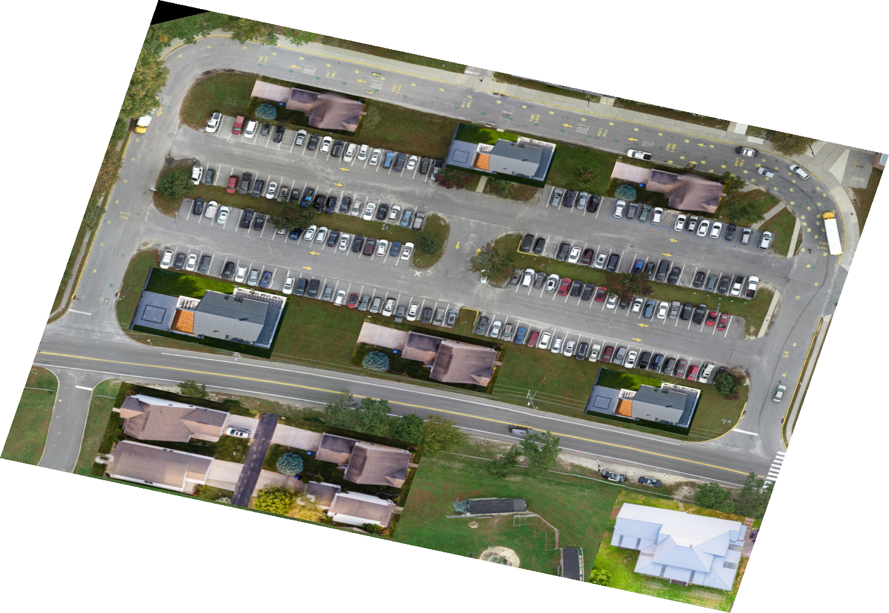
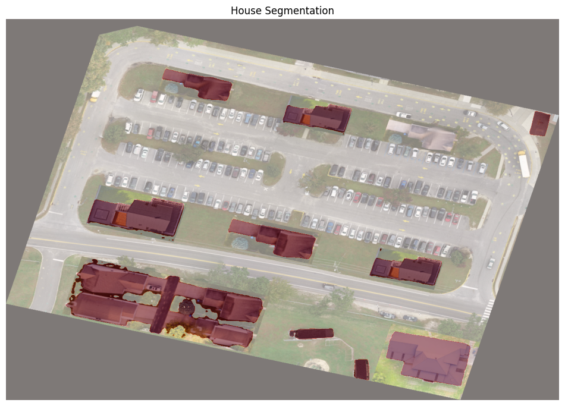
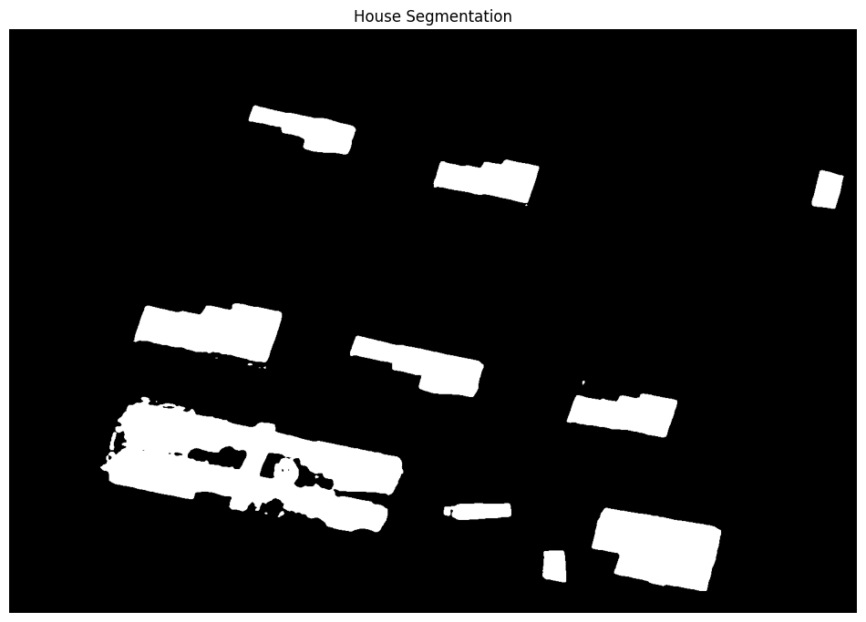
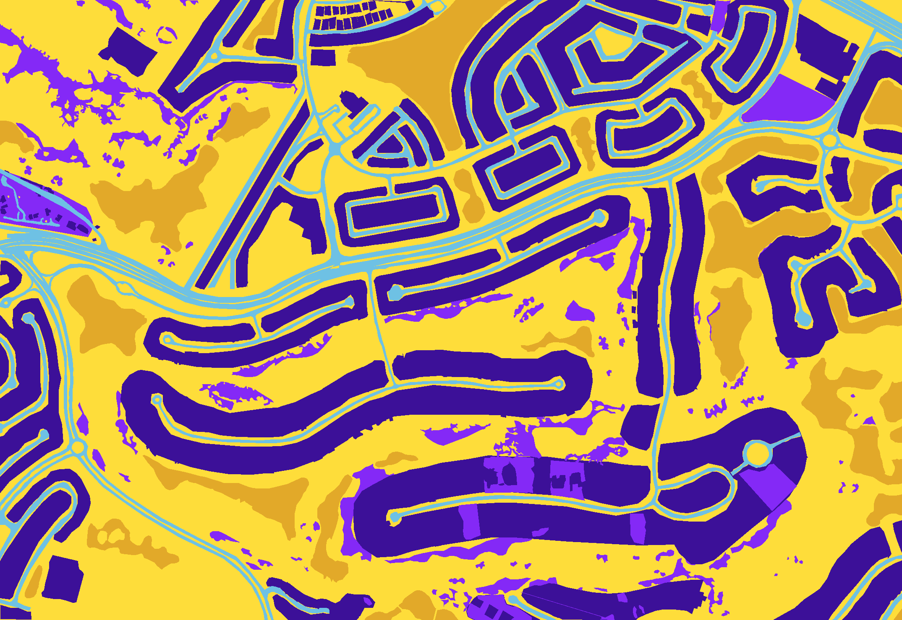
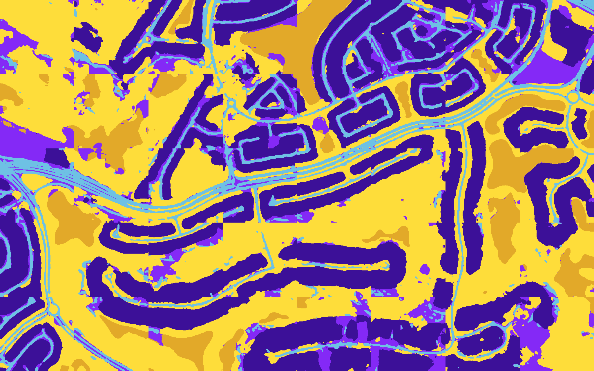
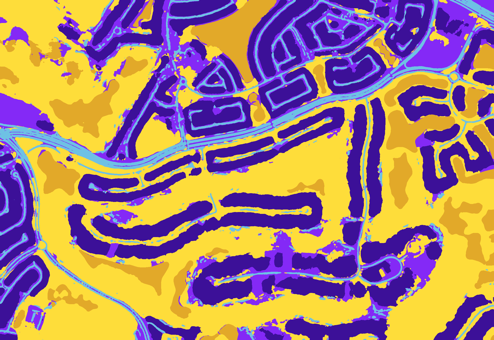
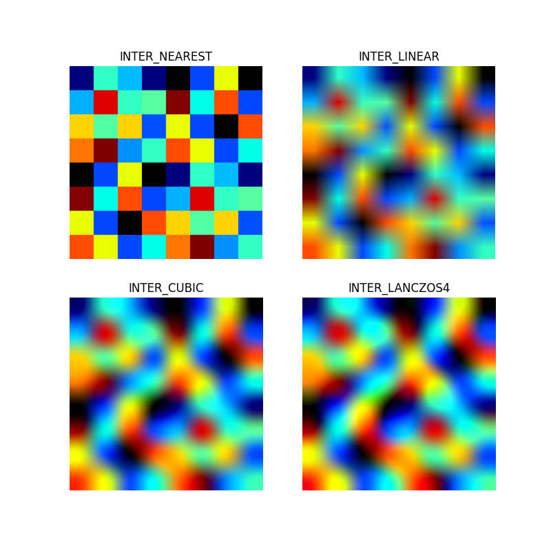
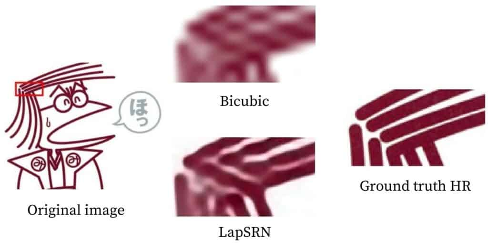
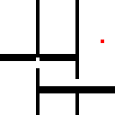

# 7 - Computer vision, Remote Sensing and GIS Technology Stack for an Autonomous Ground Vehicle


## Disclaimer

- This is just the "DOCUMENTATION" of the said project, to showcase the quality of work conducted.
- All the rights of code, models, weights, custom datasets, results and work conducted during the said project belong to e-Yantra, ERTS Lab, CSE Dept, IIT Bombay, Mumbai, India. 


## Table of Contents
- [7 - Computer vision, Remote Sensing and GIS Technology Stack for an Autonomous Ground Vehicle](#7---computer-vision-remote-sensing-and-gis-technology-stack-for-an-autonomous-ground-vehicle)
- [Disclaimer](#disclaimer)
- [Table of Contents](#table-of-contents)
- [Objectives and Deliverables](#objectives-and-deliverables)
- [Abstract](#abstract)
- [File Structure](#file-structure)
- [Domains](#domains)
- [TechStack](#techstack)
- [Video](#video)
- [Presentation](#presentation)
- [Results](#results)
  - [Finding High-Quality Datasets of Optical Aerial and Satellite Images](#finding-high-quality-datasets-of-optical-aerial-and-satellite-images)
  - [Model Weights](#model-weights)
  - [Classification and Segmentation of Optical Satellite and Aerial Images using various Computer Vision and Deep-Learning based algorithms](#classification-and-segmentation-of-optical-satellite-and-aerial-images-using-various-computer-vision-and-deep-learning-based-algorithms)
    - [SAM](#sam)
    - [SAM: House Segmentation](#sam-house-segmentation)
    - [Multi-Class Image Segmentation of Aerial Images using U-Net](#multi-class-image-segmentation-of-aerial-images-using-u-net)
    - [Road Segmentation of Aerial Images using U-Net](#road-segmentation-of-aerial-images-using-u-net)
    - [Road Segmentation of Arena Image using U-Net](#road-segmentation-of-arena-image-using-u-net)
    - [Road Segmentation of Low Quality Arena Image using U-Net](#road-segmentation-of-low-quality-arena-image-using-u-net)
    - [Potsdam: Multi-Class Image Segmentation of Aerial Images using U-Net](#potsdam-multi-class-image-segmentation-of-aerial-images-using-u-net)
    - [1024-Batch-Size: Potsdam: Multi-Class Image Segmentation of Aerial Images using U-Net](#1024-batch-size-potsdam-multi-class-image-segmentation-of-aerial-images-using-u-net)
  - [Computer Vision: Modules](#computer-vision-modules)
    - [Data Augmentation](#data-augmentation)
    - [Resize: using Interpolation](#resize-using-interpolation)
    - [SuperResolution](#superresolution)
  - [Path-Planning](#path-planning)
    - [Occupancy Grid for Path-Planning using Erosion](#occupancy-grid-for-path-planning-using-erosion)
    - [Path-Planning using ArUco Markers](#path-planning-using-aruco-markers)
  - [QGIS](#qgis)
    - [QGIS: Markers using Script](#qgis-markers-using-script)
- [Challenges Faced](#challenges-faced)
- [Future Work](#future-work)
- [Contributors](#contributors)
- [Acknowledgements and References](#acknowledgements-and-references)


## Objectives and Deliverables: 

Exploration and Path Planning for a Autonomous Ground Robot using Optical Aerial/Satellite Imagery.

* Develop a low-cost, compact ground robot using minimal hardware.
* Finding High-Quality Optical Aerial/Satellite Imagery datasets.
* Explore various Computer Vision and Deep Learning algorithms for Semantic Segmentation of Optical Aerial/Satellite Imagery
* Exploring various algorithms for path-planning and routing the ground vehicle autonomously.
* Perform real-time tracking and routing using GIS techniques.
* Implement entire pipeline developed as a prototype on the ground robot using an arena, wherein the ground robot will be tracked, controlled and routed in real time.
* Finally, evaluate the performance of the pipeline implemented.


## Abstract: 

* Prototyped a path-planning pipeline for an autonomous ground vehicle utilizing computer vision methods and ArUco Markers. 
* Remote sensing and GPS tracking using on-ground markers.


## File Structure

```
👨‍💻7-Computer-vision-Remote-Sensing-and-GIS-application-for-autonmous-ground-vehicle 
 ┣ 📂assets                             // Contains all the reference images
 ┣ 📂Datasets                           // Contains links of all Datasets referenced
 ┣ 📂Model_Weights                      // Contains model weights of DL models trained using Transfer-Learning Technique
 ┃ ┣ 📂Potsdam_1024_Batch-Size_Multi_Class_Image_Segmentation_of_Aerial_Images_using_U_Net                                           
 ┃ ┣ 📂Potsdam_Multi_Class_Image_Segmentation_of_Aerial_Images_using_U_Net                                           
 ┃ ┣ 📂Road_Segmentation_of_Low_Quality_Arena_Image_using_U_Net                                                                                    
 ┃ ┣ 📂U-Net                                          
 ┃ ┗ 📄README.md
 ┣ 📂Models                             // DL Models and Computer Vision Modules 
 ┃ ┣ 📂Modules                          // Computer Vision Modules utilized in DL Models                 
 ┃ ┃ ┣ 📂data_augmentation    
 ┃ ┃ ┣ 📂resize_using_interpolation
 ┃ ┃ ┣ 📂superresolution 
 ┃ ┃ ┗ 📄README.md                  
 ┃ ┣ 📂Potsdam_1024_Batch-Size_Multi_Class_Image_Segmentation_of_Aerial_Images_using_U_Net                                           
 ┃ ┣ 📂Potsdam_Multi_Class_Image_Segmentation_of_Aerial_Images_using_U_Net                                           
 ┃ ┣ 📂Road_Segmentation_of_Arena_Image_using_U-Net                                           
 ┃ ┣ 📂Road_Segmentation_of_Low_Quality_Arena_Image_using_U_Net                                           
 ┃ ┣ 📂Road_Segmentation_using_U-Net                                           
 ┃ ┣ 📂SAM                                           
 ┃ ┣ 📂SAM_House_Segmentation                                           
 ┃ ┣ 📂U-Net                                          
 ┃ ┗ 📄README.md   
 ┣ 📂Navigation                         // Contains code for Navigation of Autonomous Ground Vehicle                                          
 ┃ ┗ 📄README.md
 ┣ 📂Path-Planning                      // Contains Path-Planning Code
 ┃ ┣ 📂Occupancy_Grid_for_Path_Planning_using_Erosion                                           
 ┃ ┣ 📂Path-Planning_using_ArUcoMarkers                                          
 ┃ ┗ 📄README.md  
 ┣ 📂QGIS                               // Contains QGIS Code
 ┃ ┣ 📂Path Planning                    // Contains Path Planning Code using Global Coordinate System                 
 ┃ ┃ ┣ 📂A* Algorithm    
 ┃ ┃ ┣ 📂ORS (openrouteservice)
 ┃ ┃ ┗ 📄README.md  
 ┃ ┣ 📂markers_using_script
 ┃ ┗ 📄README.md                                   
 ┣ 📄LICENSE      
 ┗ 📄README.md                                               
``` 


## Domains

Image Processing, Computer Vision, Machine Learning, Deep Learning, Python, Path-Planning, Routing, Remote Sensing, QGIS


## TechStack

<p align="left"> <a href="https://colab.google/" target="_blank" rel="noreferrer"> 
</a> <a href="https://git-scm.com/" target="_blank" rel="noreferrer">  
</a> <a href="https://github.com/ars-21" target="_blank" rel="noreferrer">  
</a> <a href="https://jupyter.org/" target="_blank" rel="noreferrer">   
</a> <a href="https://keras.io/" target="_blank" rel="noreferrer"> 
</a> <a href="https://matplotlib.org/" target="_blank" rel="noreferrer">   
</a> <a href="https://numpy.org/" target="_blank" rel="noreferrer">  
</a> <a href="https://opencv.org/" target="_blank" rel="noreferrer"> 
</a> <a href="https://www.python.org" target="_blank" rel="noreferrer">   
</a> <a href="https://pytorch.org/" target="_blank" rel="noreferrer">  
</a> <a href="https://qgis.org/en/site/" target="_blank" rel="noreferrer">  
</a> <a href="https://www.raspberrypi.org/" target="_blank" rel="noreferrer">  
</a> <a href="https://www.ros.org/" target="_blank" rel="noreferrer">  
</a> <a href="https://scikit-learn.org/stable/" 
target="_blank" rel="noreferrer">  
</a> <a href="https://scipy.org/" 
target="_blank" rel="noreferrer">  
</a> <a href="https://www.tensorflow.org/" target="_blank" rel="noreferrer">  </a>


## Video

* For explanation Video [Click Here](https://www.youtube.com/watch?v=jZ7SMFGmhQI)


## Presentation

* For Brief Presentation [Click Here](https://docs.google.com/presentation/d/1Y8MahJFH0NoGtb3O5V7oFhSyE1A88Few/edit?usp=sharing&ouid=101929742373540363045&rtpof=true&sd=true)
* For Complete Presentation [Click Here](https://docs.google.com/presentation/d/1bYSzI3O5MZ1xAahykE6xqfRhRrm2qstP/edit?usp=drive_link&ouid=101929742373540363045&rtpof=true&sd=true)


## Results


### Finding High-Quality Datasets of Optical Aerial and Satellite Images

* For further reading [Click Here](./Datasets/)

Original Image                           | Ground Truth
:---------------------------------------:|:--------------------------------------:
 | 

Arena Image                           |
:------------------------------------:|
 |


### Model Weights

Model Weights of Deep Learning Models for Semantic Segmenation of Aerial/Satellite Imagery (using Transfer Learning Technique)

* For further reading [Click Here](./Model_Weights/)


### Classification and Segmentation of Optical Satellite and Aerial Images using various Computer Vision and Deep-Learning based algorithms


### SAM

* For further reading [Click Here](./Models/SAM/)

Original Input Image                                | Road Segmentation                                                              | Road Segmentation Mask
:--------------------------------------------------:|:------------------------------------------------------------------------------:|:-------------------------------------------------------------------------:
 |  | 


### SAM: House Segmentation

* For further reading [Click Here](./Models/SAM_House_Segmentation/)

Original Input Image                                                   | House Segmentation                                                                                  | House Segmentation Mask
:---------------------------------------------------------------------:|:---------------------------------------------------------------------------------------------------:|:----------------------------------------------------------------------------------------------:
 |  | 


### Multi-Class Image Segmentation of Aerial Images using U-Net

* For further reading [Click Here](./Models/U-Net/)

Original Input Image                                     | Ground Truth Mask                                                 |  Predicted Mask without Smooth Blending                                                          | Predicted Mask with Smooth Blending
:-------------------------------------------------------:|:-----------------------------------------------------------------:|:------------------------------------------------------------------------------------------------:|:-------------------------------------------------------------------------------------------------:
 |  |    | 


### Road Segmentation of Aerial Images using U-Net

* For further reading [Click Here](./Models/Road_Segmentation_using_U-Net/)

Original Input Image                                                             |  Predicted Mask without Smooth Blending                                                                                  | Predicted Mask with Smooth Blending
:-------------------------------------------------------------------------------:|:------------------------------------------------------------------------------------------------------------------------:|:-------------------------------------------------------------------------------------------------------------------------:
 |    | 


### Road Segmentation of Arena Image using U-Net

* For further reading [Click Here](./Models/Road_Segmentation_of_Arena_Image_using_U-Net/)

Original Input Image                                                             |  Predicted Mask without Smooth Blending                                                                                  | Predicted Mask with Smooth Blending
:-------------------------------------------------------------------------------:|:------------------------------------------------------------------------------------------------------------------------:|:-------------------------------------------------------------------------------------------------------------------------:
 |    | 


### Road Segmentation of Low Quality Arena Image using U-Net

* For further reading [Click Here](./Models/Road_Segmentation_of_Low_Quality_Arena_Image_using_U_Net/)

Original Input Image                                                                                     | Ground Truth Mask                                                                                               |  Predicted Mask without Smooth Blending                                                                                        | Predicted Mask with Smooth Blending
:-------------------------------------------------------------------------------------------------------:|:---------------------------------------------------------------------------------------------------------------:|:------------------------------------------------------------------------------------------------------------------------------:|:-------------------------------------------------------------------------------------------------------------------------------------------:
 |  |  | 


### Potsdam: Multi-Class Image Segmentation of Aerial Images using U-Net

* For further reading [Click Here](./Models/Potsdam_Multi_Class_Image_Segmentation_of_Aerial_Images_using_U_Net/)

Original Input Image                                                                                                   | Ground Truth Mask                                                                                                               |  Predicted Mask without Smooth Blending                                                                                                                      | Predicted Mask with Smooth Blending
:---------------------------------------------------------------------------------------------------------------------:|:-------------------------------------------------------------------------------------------------------------------------------:|:------------------------------------------------------------------------------------------------------------------------------------------------------------:|:-------------------------------------------------------------------------------------------------------------------------------:
 |  |  | 


### 1024-Batch-Size: Potsdam: Multi-Class Image Segmentation of Aerial Images using U-Net

* For further reading [Click Here](./Models/Potsdam_1024_Batch-Size_Multi_Class_Image_Segmentation_of_Aerial_Images_using_U_Net/)

Original Input Image                                                                                                                   | Ground Truth Mask                                                                                                                               |  Predicted Mask without Smooth Blending                                                                                                                                        | Predicted Mask with Smooth Blending
:-------------------------------------------------------------------------------------------------------------------------------------:|:-----------------------------------------------------------------------------------------------------------------------------------------------:|:------------------------------------------------------------------------------------------------------------------------------------------------------------------------------:|:------------------------------------------------------------------------------------------------------------------------------------------------------------------------------:
 |  |    | 


### Computer Vision: Modules


### Data Augmentation

* For further reading [Click Here](./Models/Modules/data_augmentation/)


### Resize: using Interpolation

* For further reading [Click Here](./Models/Modules/resize_using_interpolation/)




### SuperResolution

* For further reading [Click Here](./Models/Modules/superresolution/)




### Path-Planning


### Occupancy Grid for Path-Planning using Erosion

* For further reading [Click Here](./Path-Planning/Occupancy_Grid_for_Path_Planning_using_Erosion/)

Original Input Mask                                                                                    | Occupancy Grid
:-----------------------------------------------------------------------------------------------------:|:-----------------------------------------------------------------------------------------------------------:
 | 


### Path-Planning using ArUco Markers

* For further reading [Click Here](./Path-Planning/Path-Planning_using_ArUcoMarkers/)


### QGIS

### QGIS: Markers using Script

* For further reading [Click Here](./QGIS/markers_using_script/)


## Challenges Faced

* Aerial/Satellite Images were quite large in size (some even 200-350 MB per image), making it very difficult to load and utilize the datasets for transfer learning/inputs for predictions.
* Limitations of RAM, GPU Memory in local systems - leading to longer training/prediction time, or crashes
* Limitations of RAM in Google Colab - owing to large dataset sizes - leading to crashes
    * Memory deallocation of not-required variables.
    * Utilizing smaller/compressed datasets
* Distorted geo-referenced images, hence unable map pixel & global coordinated accurately
* Path planning using A*(star) on cost map, was very time consuming and computationally expensive
* High latency in communication between controller(laptop) and robot, causing issues in live-control of on-ground vehicle


## Future Work

* Path-Planning and Live-Control of Autonomous Ground Vehicle using Edges of Road - found using Segmented Mask
* Utilize Geo-referenced Image & Masks for global tracking/control of autonomous ground vehicle.
* Path-Planning and Live-Control of Autonomous Ground Vehicle using optimised Deep-Learning Techniques like “[Neural A*(Star)](https://github.com/omron-sinicx/neural-astar)”

A*(star)                                                                            | Neural A*(star)
:----------------------------------------------------------------------------------:|:-------------------------------------------------------------------------------------------------:
 | 


## Contributors

* [Aryan Sanjay Shah](https://github.com/ars-21)
* [Agnael Karan]()
* [Ansh Gupta](https://github.com/26anshgupta)


## Acknowledgements and References

* e-Yantra Summer Internship Program - 2023([eYSIP](https://www.e-yantra.org/eysip))
* Special thanks to our mentors [Saail Narvekar Sir](https://github.com/SaailN), [Aditya Panwar Sir](), and all the mentors at e-Yantra for their constant support and guidance throughout the project
